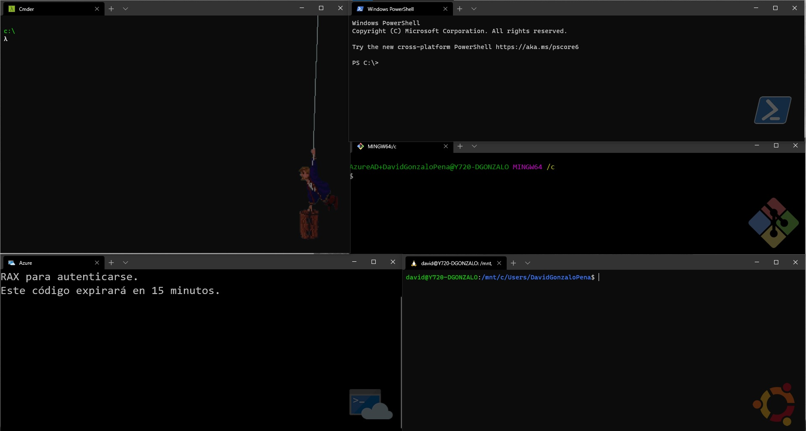

# WindowsTerminalSettings
My configurations settings for Windows Terminal 

The file settings.json content my configuration using the terminals:
- [Cmder](https://cmder.net/)
- [Azure Cloud Shell](https://devblogs.microsoft.com/commandline/the-azure-cloud-shell-connector-in-windows-terminal/)
- [Ubuntu Shell  Subsystem for Linux)](https://ubuntu.com/wsl)

## How add to right-click context menu 
1 - Copy `./images/wt_32.ico` to path `%USERPROFILE%\AppData\Local\terminal\wt_32.ico`
2 - Edit WindowsTerminalHere.reg and replace in 8:line **HereYourUserName** for you username.
3 - Run WindowsTerminalHere.reg
4 - enjoy! 😉

More info about Windows terminal [here](https://docs.microsoft.com/en-us/windows/terminal/)

